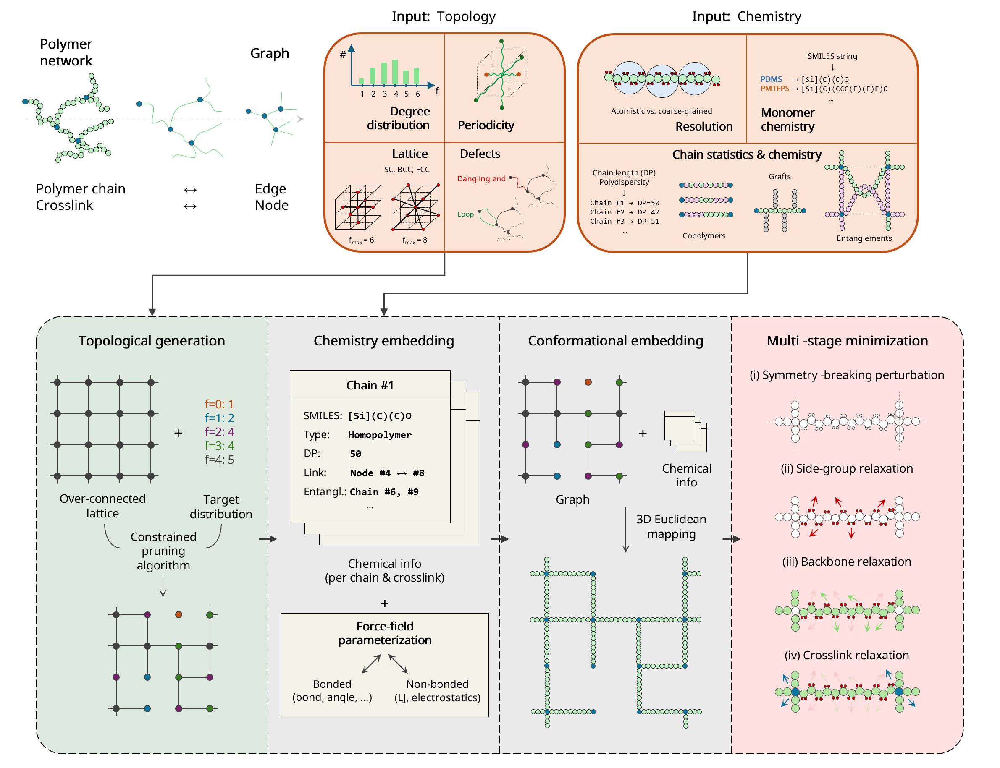

# Topon: Topological Polymer Network Generator

**Topon** is a modular Python package for generating complex polymer network structures for Molecular Dynamics (MD) simulations. It bridges the gap between graph-theoretical topology and physical chemical structures, supporting both Coarse-Grained (KG) and Atomistic (All-Atom) models.



## Key Features

- **Graph-Based Topology**: Define network connectivity first, then map to chemistry.
- **Dual Resolution**:
  - **Coarse-Grained (CG)**: Kremer-Grest model (FENE/Harmonic bonds, LJ potentials).
  - **Atomistic**: Full chemistry (e.g., PDMS, Silica, POSS) with DREIDING force field.
- **Advanced Architecture**:
  - **Entanglements**: Physical knots (Gaussian Kinks) preserving topology; single and multi-entanglement supported.
  - **Copolymers**: Block, Random, and Alternating sequences.
  - **Grafts**: Side-chain functionalization with dynamic scaling.
  - **Defects**: Configurable injection of primary loops (parallel edges).
  - **POSS Junctions**: Polyhedral Oligomeric Silsesquioxane node chemistry.
  - **Custom Topology**: Load any graph from `.nodes`/`.edges` or `.graphml` files.
- **Workflow Automation**: Integrated `SimulationRunner` for LAMMPS execution.
- **Ensemble Generation**: Multiprocessing orchestrator for batch production runs.
- **Molecule Packing** (`simbox`): General-purpose box packer for arbitrary molecular systems (Epoxy-PDMS, Amino-PDMS, POSS) with crosslinking simulation templates.

## Installation

```bash
git clone https://github.com/keten-group/topon.git
cd topon
pip install -e .
```

## Quick Start

Configuration is JSON-based. Runnable demo cases live under [`demos/`](demos/):

- [`demos/npjcompmat/atomistic/`](demos/npjcompmat/atomistic/) — atomistic (DREIDING) network demo
- [`demos/npjcompmat/coarsegrained/`](demos/npjcompmat/coarsegrained/) — coarse-grained (Kremer-Grest) network demo

Each demo folder contains a runnable script, its configuration, and a short README describing what it produces.

Minimal config shape:

```json
{
    "chemistry": {
        "model_type": "coarse_grained",
        "degree_of_polymerization": 20
    },
    "assignment": {
        "entanglements": {"enabled": true, "target": 5},
        "grafts": {"enabled": true, "per_edge_type": {"A": {"graft_density": 0.05}}}
    }
}
```

## CLI

The `topon` command-line interface is **work in progress**. For now, use the package API directly — see the demo scripts for example usage patterns.

## Documentation

| Document | Description |
|---|---|
| [docs/cli.md](docs/cli.md) | CLI reference (WIP) |
| [docs/config_reference.md](docs/config_reference.md) | Configuration reference — every JSON key with examples |
| [docs/simbox.md](docs/simbox.md) | `simbox` sub-system: molecule packing for crosslinking |
| [docs/cg_ensemble_execution.md](docs/cg_ensemble_execution.md) | Ensemble / batch production workflow |

## License

MIT. See [LICENSE](LICENSE).
