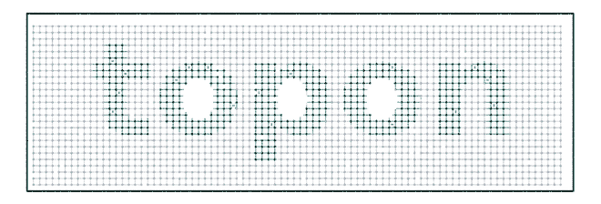
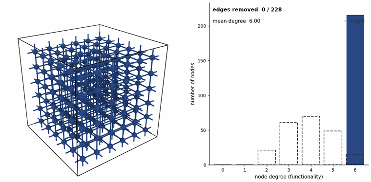
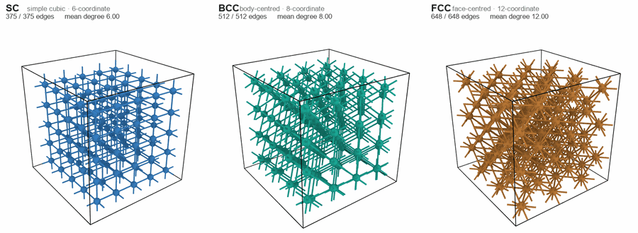
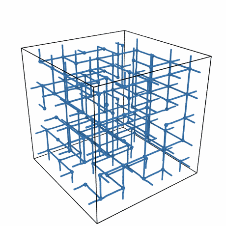
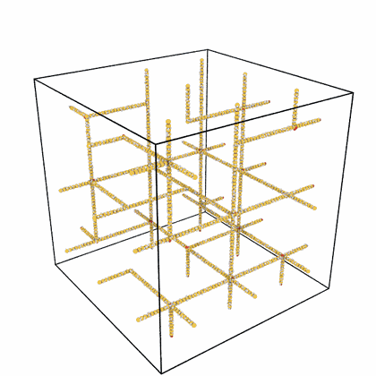
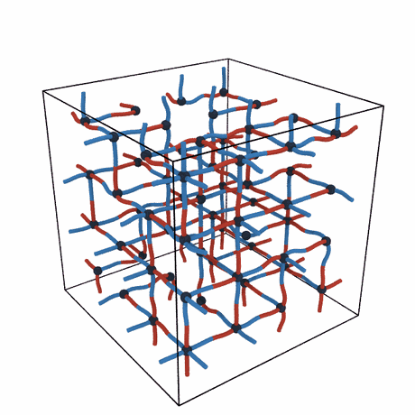
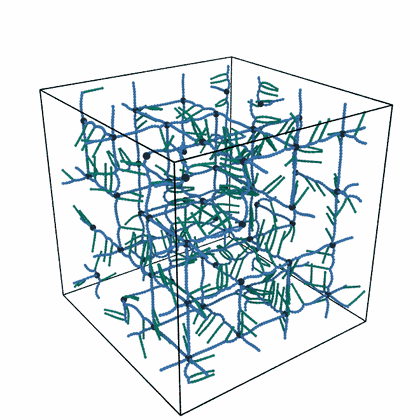
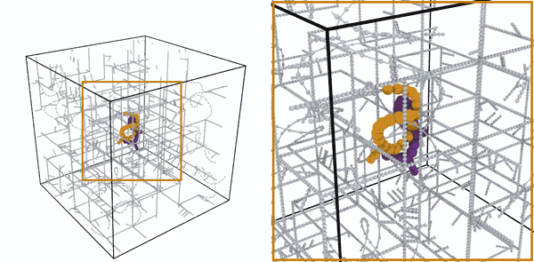

<p align="center">
  
</p>

# topon

[](https://doi.org/10.5281/zenodo.19672939)

topon generates polymer networks with a prescribed topology and writes them as LAMMPS input files. It also builds
crosslinked protein networks from an amino-acid sequence.

The network is built as a graph first (i.e., which junctions connect, how long the strands are and what sits on them),
and the chemistry is mapped onto it afterwards. The same graph can therefore be written as a coarse-grained or an
all-atom system.

```
Topology → Analysis → Assignment → Chemistry → Conformation → Output
```

## Network generation

topon starts from a lattice of junctions and removes edges until the degree distribution matches the requested one.

<p align="center">
  
</p>

<sub>Nodes are colored by their current degree, and the histogram approaches the requested distribution (dashed). The
animation replays the edge removals recorded by the generator on a 6x6x6 lattice.</sub>

There are two searches, both implemented in Python and in C. Pruning (`strict`) removes edges one at a time. Exact
matching (`exact`) finds a subgraph of the lattice with exactly the requested number of sites of each degree, so it
needs a count for every degree. The pipeline uses the Python generator unless `topology.generator.exe_path` points to
the compiled C generator (`topon/topology/csrc/generator.c`), which also runs on its own.

<p align="center">
  
</p>

<sub>SC, BCC and FCC lattices (6, 8 and 12 neighbors) pruned to a mean degree of 4.</sub>

Diamond (4 neighbors) and `MIX` (SC, BCC and FCC sites overlaid at chosen fractions) are also available. A neighbor
cutoff lets strands connect sites beyond the nearest neighbors, and each axis can be periodic or open (e.g., a slab
with a free surface). `topology.generator.seed` pins the generated graph.

Networks crosslinked along their chains (e.g., vulcanized rubber or a protein gel) are built in two ways. With
`topology.source: "crosslink"` topon grows the chains as a self-avoiding melt on a cubic lattice and crosslinks the
reactive beads that touch, so every strand's length follows from where the crosslinks fell. With
`architecture: "random_crosslinked"` a sculpted lattice graph is covered with chains of a given length instead.

## Measuring and matching networks

`topon analyze` measures a network, from a graph or from a LAMMPS data file, with a set of connectivity descriptors
(cycles, clustering, betweenness, effective resistance, the spectrum and the chord statistics) and, when Z1+ is
installed, the primitive-path entanglements per strand. `--compare` scores it against a reference. `topon fit` reads an
existing network (e.g., one made by `fix bond/create` in LAMMPS) and writes a config whose generated networks match
it, and `topon generate --verify` checks that config against the reference.

## Output

In the generated network the strands run straight between their junctions. topon therefore also writes the LAMMPS
input scripts that relax it into an equilibrated melt with the same connectivity.

<table>
<tr>
<td width="50%"></td>
<td width="50%"></td>
</tr>
<tr>
<td>Coarse-grained Kremer-Grest network relaxing from the lattice.</td>
<td>All-atom PDMS network with DREIDING (silicon in gold, oxygen in red).</td>
</tr>
</table>

Atomistic strands are drawn at their bond lengths and settled before the first stage so that no two backbone bonds
start closer than 1.5 Å, and the relaxation keeps the backbone hard so that strands do not pass through each other,
which a crossing detector checks at every stage. The coarse-grained relaxation uses a capped push-off for the same
reason. `topon track` writes an HTML page that follows an
atomistic relaxation stage by stage (the network, the entanglements, the energy, the density and any strand that
passed through another).

## Strand features

- Copolymer sequences (block, random, alternating or gradient), set per strand.
- Side-chain grafts of a chosen length and monomer, with a density set per edge type.
- Entanglements, drawn as pairs of neighboring strands wound around each other a set number of times, so that they
  stay interlocked during relaxation.
- Defects such as secondary loops (two strands between the same pair of junctions), placed without exceeding the
  maximum functionality of a junction.
- POSS chain caps with the Si₈O₁₂ cage.

<p align="center">
  
  
</p>

<sub>Left, a block copolymer network (A in red, B in blue). Right, side chains (teal) on a blue backbone.</sub>

<p align="center">
  
</p>

<sub>Two entangled strands (gold and violet) in the network and in a close-up, relaxing from the lattice.</sub>

## Force fields

Coarse-grained networks use the Kremer-Grest model, and atomistic networks use DREIDING by default. With
`chemistry.force_field: "charmm"` an atomistic network is written with CHARMM parameters instead. Each monomer and
junction names its residue in the RTF files you supply, and every term comes from the parameter files. A residue or
term the files do not define stops the build with the full list, and nothing is filled in by default.
[`demos/polymer/atomistic/charmm_peg/`](demos/polymer/atomistic/charmm_peg/) builds a PEG network with the bundled
CHARMM ether parameters.

## Protein networks

`topon protein` builds a crosslinked protein network from an amino-acid sequence, in CHARMM36m (all-atom) or Martini 3
(coarse-grained).

```bash
# Martini 3 (polyply chain topology), 30 wt% water with 0.15 M NaCl
topon protein --sequence GRGDSPYAAAAAAAAA --repeats 12 --chains 8 \
              --model martini --water-content 30 --output ./run_martini

# the same network in CHARMM36m, all-atom
topon protein --sequence GRGDSPYAAAAAAAAA --repeats 12 --chains 8 \
              --model charmm --water-content 30 --output ./run_charmm
```

The chains are grown as a self-avoiding melt on a cubic lattice, one site per residue, and crosslinked where their
tyrosines touch (dityrosine) or, with `--crosslink-residue C`, their cysteines (disulfide), up to the gel point. A build
that does not gel stops and says so. `--crosslink-method adjacent` gives the node lattice of the bond-fluctuation model
that earlier versions used. In CHARMM36m the atoms are placed from the force field's internal-coordinate tables,
each crosslink is the RTF's patch (`DITY` or `DISU`), and every term, including the 1-4 terms, NBFIX and the CMAP
grids, comes from the parameter file. `--seed` pins the whole build, and `protein_network_summary.json` records what was
built. Martini 3 represents tryptophan with a virtual site, which LAMMPS lacks, so the Martini model refuses it. A bond
that the soft relaxation stage threads through a ring is detected and reported, not prevented. See
[`demos/protein/`](demos/protein/) for both models.

## Installation

```bash
git clone https://github.com/keten-group/topon.git
cd topon
pip install -e .
```

LAMMPS is needed only to run the generated inputs. Martini 3 protein networks of a sequence other than the bundled
resilin reference need polyply (`pip install -e ".[martini]"`). The C generator is optional. Build it with
`gcc -O2 -o generator.exe generator.c -lm` in `topon/topology/csrc/` and set `topology.generator.exe_path` to the
binary. Z1+ is optional too, and topon calls it when it is installed (its license does not allow topon to ship it).

## Getting started

```bash
topon init --output my_run.json        # starter config
topon generate my_run.json --output ./runs
```

Running `topon` without arguments opens an interactive session. `topon doctor` checks a config before a run,
`topon inspect` summarizes a finished run and `topon recipes` lists worked examples. Ready-made configs are in
[`demos/`](demos/), and the atomistic demos include the output of a full relaxation.

## Documentation

| | |
|---|---|
| [docs/USAGE.md](docs/USAGE.md) | Command line, Python API, recipes and config reference |
| [docs/ARCHITECTURE.md](docs/ARCHITECTURE.md) | The six stages and how they fit together |
| [demos/README.md](demos/README.md) | Demo configs and scripts |
| [demos/npjcompmat/](demos/npjcompmat/README.md) | Data and notebooks behind the figures of the paper |
| [CHANGELOG.md](CHANGELOG.md) | Changes between releases |

## Citation

If you use topon, please cite it with the metadata in [`CITATION.cff`](CITATION.cff) (GitHub shows it under "Cite
this repository"). The DOI above resolves to the latest release on Zenodo.

## License

MIT. See [LICENSE](LICENSE). The bundled CHARMM and Martini force-field files keep their own licenses (MIT and
Apache-2.0), listed in [THIRD_PARTY_LICENSES.md](THIRD_PARTY_LICENSES.md).
